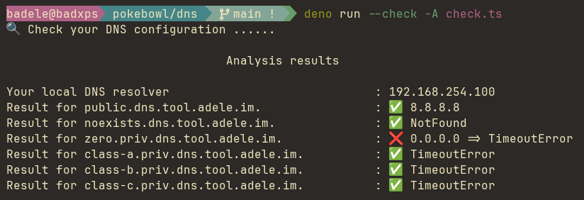

# DNS rebinding

## DNS Rebinding checker or USP block the RFC1918 private address

This tool can be used to verify if your are protected from the DNS rebinding or if your USP block the RFC1918 private address resolution

```shell
# Local
deno run --check -A check.ts

#Remote
deno run --check -A https://raw.githubusercontent.com/badele/pokebowl/main/dns/dns-rebinding/check.ts
```


## About DNS rebinding

DNS rebinding is a cybersecurity technique that exploits flaws in how web browsers enforce the same-origin policy. This policy normally prevents web pages from making requests to domains different from their own for security reasons. However, DNS rebinding manipulates the Domain Name System (DNS) resolution process to bypass this policy. 

Here's a simplified summary of how it works:

1. The attacker sets up a malicious website and tricks a user into visiting it.

2. The malicious website loads some legitimate content from a target domain, such as an IoT device or a private network router, by using a DNS name associated with that target domain.

3. After the initial page load, the attacker changes the DNS mapping for the target domain to point to their own malicious server, which may be under their control.

4. When the user interacts with the content loaded from the target domain (e.g., by clicking a button), the browser sends HTTP requests to the new IP address associated with the target domain (which now points to the attacker's server).

5. The attacker's server can then access and control the user's device or network resources as if it were the legitimate target domain, potentially leading to unauthorized access, data theft, or further exploitation.

To defend against DNS rebinding attacks, web browsers have implemented security mechanisms, such as DNS pinning, to prevent the manipulation of DNS resolutions after the initial page load. Additionally, web developers can implement security headers, like Content Security Policy (CSP), to mitigate the risk of this type of attack.

DNS rebinding attacks underscore the importance of keeping web browsers and networking equipment up-to-date with the latest security patches to minimize the risk of exploitation.

**References**:
  - [DNS rebinding explained](https://www.gabriel.urdhr.fr/2021/06/02/dns-rebinding-explained)
  - [Singularity DNS rebinding attacks](https://github.com/nccgroup/singularity/wiki)
  - [Singulary scan demo](http://rebind.it:8080/singularity.html)
